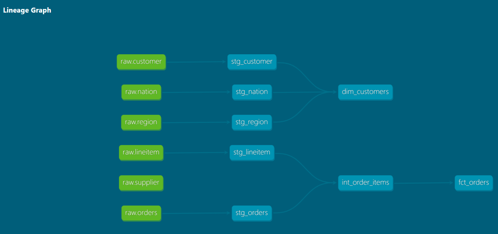
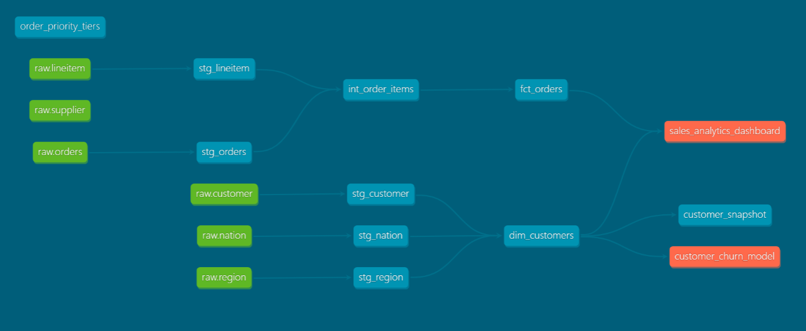
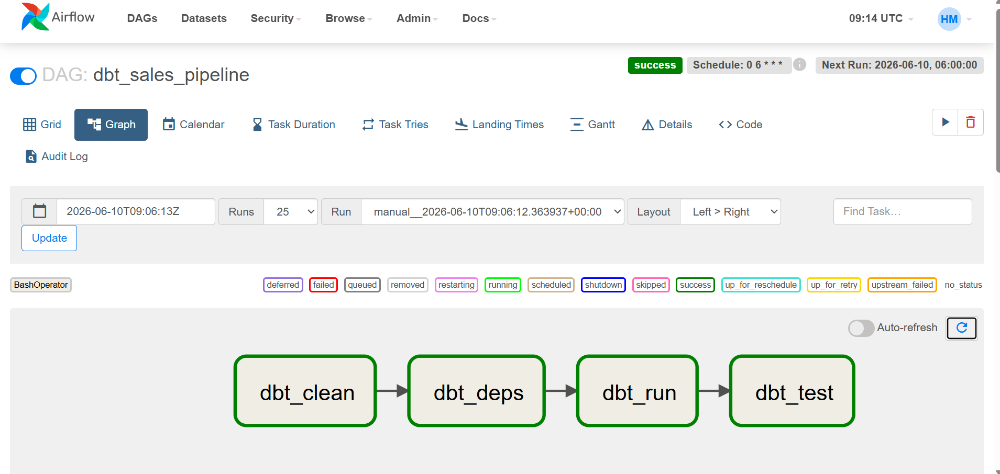

# Sales Analytics Pipeline
## dbt · Snowflake · Apache Airflow

End-to-end ELT pipeline processing 1.5M orders from TPC-H dataset using dbt for transformation, Snowflake as the cloud warehouse, and Apache Airflow for orchestration.

---

## Architecture

## Stack
| Layer | Tool |
|---|---|
| Warehouse | Snowflake (Azure) |
| Transformation | dbt-core 1.11, dbt_utils, dbt_expectations |
| Orchestration | Apache Airflow 2.6.3 |
| Source Data | TPC-H SF1 — 1.5M orders, 6M line items |
| Version Control | GitHub |

## dbt Project Includes
- 5 staging models with sources.yml
- 1 intermediate model (ephemeral CTE)
- fct_orders — incremental fact table (1.5M rows)
- dim_customers — enriched dimension (150K rows)
- customer_snapshot — SCD Type 2 history tracking
- order_priority_tiers — seed CSV
- 2 custom Jinja macros
- dbt_utils + dbt_expectations data quality tests
- 25 passing data tests
- Full column-level documentation

## Screenshots

### dbt Lineage Graph

### dbt Lineage Graph — Full Detail with Exposures

### Airflow DAG — All Tasks Green

### Prerequisites
- Python 3.11+
- Snowflake account
- Git

### Setup

1. Clone the repository

git clone https://github.com/harishmutchanakka/DBT_Snowflake_Airflow_TCP_H.git
cd DBT_Snowflake_Airflow_TCP_H

2. Create and activate virtual environment

python -m venv venv
venv\Scripts\activate

3. Install dbt

pip install dbt-snowflake

4. Configure Snowflake credentials

Create ~/.dbt/profiles.yml with your Snowflake credentials
See profiles.yml.example for the required format

5. Install dbt packages

dbt deps

6. Load seed data

dbt seed

7. Run all models

dbt run

8. Run tests

dbt test

9. View documentation

dbt docs generate
dbt docs serve